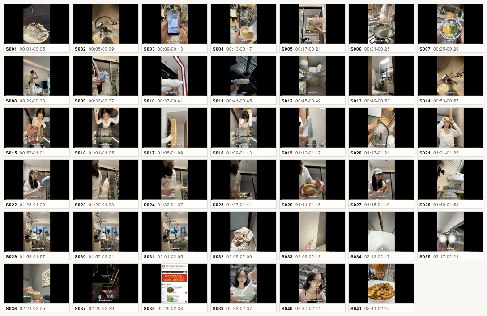

# Viral Video Decomposer

拆解爆款短视频，把一个“小红书/抖音/B站/TikTok 视频”变成可复用的生产蓝图。

它不是只告诉你“这个视频为什么火”，而是输出可以继续交给视频生成 agent、选题 agent、脚本 agent 使用的结构化资产：镜头级拉片表、爆款机制、变量槽、AI 生产蓝图、批量选题方向和 JSON brief。



## What This Does

**Viral Video Decomposer** helps creators, marketers and AI-video builders reverse-engineer viral short videos without copying the original expression.

It focuses on reusable structure:

- **Shot-level decomposition** — timecode, visual, action, narrative job and emotional job for each key shot.
- **Viral mechanism** — hook, curiosity gap, rhythm, trust signals, audience fantasy and comment trigger.
- **Production blueprint** — the reusable skeleton behind the video.
- **Variable slots** — what can be swapped to create new original videos.
- **AI-ready JSON brief** — structured data for downstream video-generation agents.
- **Polished HTML report** — a `Viral Video Lab` report with A/B visual styles, contact sheet and compact analysis modules.

## Example Output

This repo includes a sample decomposition generated from a Xiaohongshu lifestyle Vlog:

- [HTML report](examples/xhs-rook-time-spend/xhs-rook-time-spend_图文拆解报告.html)
- [Shot-by-shot markdown](examples/xhs-rook-time-spend/xhs-rook-time-spend_拉片拆解.md)
- [Video generation brief JSON](examples/xhs-rook-time-spend/xhs-rook-time-spend_video_generation_brief.json)
- [Contact sheet](examples/xhs-rook-time-spend/xhs-rook-time-spend_contact_sheet.jpg)

## Report Style

The default report is a dense professional analysis surface, not a landing page.

It uses:

- `Viral Video Lab` topbar
- `Core / Shots / Blueprint / Prompt` navigation
- A/B visual style switch
- compact key-shot contact sheet
- card-style analysis modules
- consistent `AI 生产蓝图` styling across both themes

The style contract lives in:

- [`references/report-style.md`](skill/references/report-style.md)
- [`references/viral-video-lab.css`](skill/references/viral-video-lab.css)

## Installation

### Use With Codex Or Other Coding Agents

Give your agent this repo link and ask it to use the skill:

```text
Use the Viral Video Decomposer skill from:
https://github.com/sharon-laicc/viral-video-decomposer
```

The agent should start from:

```text
SKILL.md
```

and load support files only when needed:

```text
skill/references/output-contract.md
skill/references/report-style.md
skill/references/viral-video-lab.css
```

### Manual Skill Installation

Copy the standalone skill folder into your local skills directory.

For Codex-style local skills:

```bash
mkdir -p ~/.codex/skills/viral-video-decomposer
cp -R skill/* ~/.codex/skills/viral-video-decomposer/
```

For Claude Code-style local skills:

```bash
mkdir -p ~/.claude/skills/viral-video-decomposer
cp -R skill/* ~/.claude/skills/viral-video-decomposer/
```

### Claude Code Custom Marketplace Source

If you publish this repo publicly and keep `.claude-plugin/marketplace.json`, Claude Code users can try installing it with:

```text
/plugin marketplace add https://github.com/sharon-laicc/viral-video-decomposer
```

Then:

```text
/plugin install viral-video-decomposer@viral-video-decomposer
```

After installation, use:

```text
/viral-video-decomposer:viral-video-decomposer
```

## Usage

Paste a video link, transcript, screenshots, recording, or contact sheet:

```text
帮我拆解这个爆款视频：
https://www.xiaohongshu.com/...
```

For a full report, ask:

```text
生成完整拉片表、爆款机制、AI 生产蓝图、变量槽、JSON brief，并输出 HTML 报告。
```

For remixing without copying:

```text
复用这个视频的结构，但换成我的选题，不要复刻原文案和具体镜头。
```

## Output Files

For substantial requests, the skill should produce:

```text
*_拆解报告.html
*_拉片拆解.md
*_video_generation_brief.json
visual/contact_sheet.jpg
visual/S001.png ...
```

## Originality Guardrails

This skill analyzes patterns, not protected expression.

Reusable:

- structure
- pacing
- emotional function
- shot role
- variable slots
- production logic

Must change:

- exact wording
- creator persona
- distinctive jokes
- unique life details
- original footage
- brand marks
- exact highly distinctive shot sequence

## Repository Structure

```text
.
├── SKILL.md
├── skill/
│   ├── SKILL.md
│   ├── agents/
│   └── references/
├── plugins/
│   └── viral-video-decomposer/
├── examples/
│   └── xhs-rook-time-spend/
├── docs/
│   └── assets/
└── .claude-plugin/
    └── marketplace.json
```

## License

MIT
