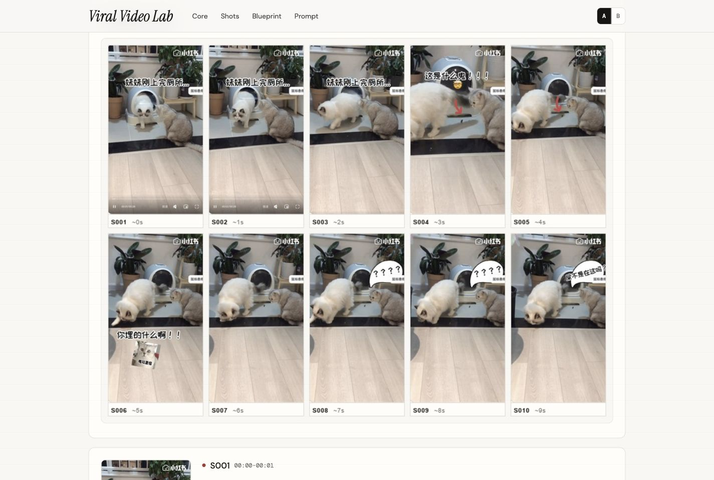

# Video Structure Analyzer

> Short videos are not magic. They are reusable structures hiding inside timing, shots, captions, and emotion.

**Video Structure Analyzer** is a Codex / Claude skill that turns a short-video link, transcript, screen recording, or frame set into a polished `Viral Video Lab` HTML report, shot-by-shot breakdown, and AI-ready production brief.

中文一句话：把一个小红书、抖音、B站、TikTok 爆款短视频，拆成可复用的「镜头结构 + 爆款机制 + AI 生产蓝图」。

It does not just explain why a video works. It produces assets you can reuse:

```text
video link / screenshots / transcript
-> shot evidence
-> viral mechanism
-> reusable production blueprint
-> HTML report + Markdown + JSON brief
```

## Showcase

The default output is a designed HTML report, not a plain markdown note.

### Style A · Editorial Lab

Warm paper, serif headline, compact cards, and a working-research feel.


### Style B · Swiss Blueprint

Swiss-inspired grid, Helvetica-style typography, and restrained blue system accents.


### Analysis Surface

Every report includes key frames, shot cards, narrative function, emotional function, variable slots, and an AI prompt template.



## Demo Case

Included demo:

```text
这是一条有味道的视频 - 咪咪子嘤嘤嘤
```

The skill extracts the reusable comedy structure:

```text
normal pet behavior
-> visible accident evidence
-> creator-style caption commentary
-> pet personification
-> punchline / comment trigger
```

Open the generated files:

- [HTML report](examples/xhs-smelly-cat/xhs-smelly-cat_图文拆解报告.html)
- [Shot-by-shot markdown](examples/xhs-smelly-cat/xhs-smelly-cat_拉片拆解.md)
- [Video generation brief JSON](examples/xhs-smelly-cat/xhs-smelly-cat_video_generation_brief.json)
- [Contact sheet](examples/xhs-smelly-cat/xhs-smelly-cat-visual/contact_sheet.jpg)

## Why This Exists

Most "viral video analysis" stops at vague comments:

```text
hook is strong
rhythm is good
content is relatable
```

That is not enough for production.

This skill treats a viral video as a reusable machine:

- What is the first-frame promise?
- Where is the curiosity gap?
- Which shot proves the point?
- Which caption creates the joke or tension?
- What emotional job does each shot perform?
- Which parts are reusable, and which parts must be changed?
- What should a downstream video-generation agent receive?

The output is designed for creators, marketers, AI video builders, and agents that need executable structure rather than vibes.

## At A Glance

| What you get | Description |
|---|---|
| `*_图文拆解报告.html` | Shareable `Viral Video Lab` report with A/B styles |
| `*_拉片拆解.md` | Human-readable shot table and mechanism notes |
| `*_video_generation_brief.json` | Structured brief for downstream AI agents |
| `visual/contact_sheet.jpg` | Compact visual evidence overview |
| `visual/S001.png...` | Sampled frames used by the analysis |

## What The HTML Report Contains

- Source facts and engagement metrics
- One-paragraph core thesis
- Production storyboard compression table
- Compact key-frame contact sheet
- Shot-by-shot analysis cards
- Viral mechanism summary
- AI production blueprint
- Reusable variable slots
- Agent prompt template
- A/B style toggle

## Quickstart

Paste a video link, transcript, screenshots, recording, or contact sheet:

```text
帮我拆解这个爆款视频：
https://www.xiaohongshu.com/...
```

Ask for the full deliverable:

```text
生成完整拉片表、爆款机制、AI 生产蓝图、变量槽、JSON brief，并输出 HTML 报告。
```

Ask for a transformed production plan:

```text
复用这个视频的结构，但换成我的选题，不要复刻原文案和具体镜头。
```

## Installation

### Use With Codex Or Other Coding Agents

Give your agent this repo link and ask it to use the skill:

```text
Use the Viral Video Decomposer skill from:
https://github.com/sharon-laicc/viral-video-decomposer
```

The agent should start from:

```text
SKILL.md
```

and load support files only when needed:

```text
skill/references/output-contract.md
skill/references/report-style.md
skill/references/viral-video-lab.css
```

### Manual Skill Installation

Copy the standalone skill folder into your local skills directory.

For Codex-style local skills:

```bash
mkdir -p ~/.codex/skills/viral-video-decomposer
cp -R skill/* ~/.codex/skills/viral-video-decomposer/
```

For Claude Code-style local skills:

```bash
mkdir -p ~/.claude/skills/viral-video-decomposer
cp -R skill/* ~/.claude/skills/viral-video-decomposer/
```

### Claude Code Custom Marketplace Source

If you publish this repo publicly and keep `.claude-plugin/marketplace.json`, Claude Code users can try installing it with:

```text
/plugin marketplace add https://github.com/sharon-laicc/viral-video-decomposer
```

Then:

```text
/plugin install viral-video-decomposer@viral-video-decomposer
```

After installation, use:

```text
/viral-video-decomposer:viral-video-decomposer
```

## Report Style Contract

The HTML report follows a locked `Viral Video Lab` design system:

- `Viral Video Lab` topbar
- `Core / Shots / Blueprint / Prompt` navigation
- A/B visual style switch
- compact key-shot contact sheet
- card-style analysis modules
- consistent `AI 生产蓝图` module styling across both themes
- mobile-friendly compact topbar

The style contract lives in:

- [`references/report-style.md`](skill/references/report-style.md)
- [`references/viral-video-lab.css`](skill/references/viral-video-lab.css)

## Originality Guardrails

This skill analyzes patterns, not protected expression.

Reusable:

- structure
- pacing
- emotional function
- shot role
- variable slots
- production logic

Must change:

- exact wording
- creator persona
- distinctive jokes
- unique life details
- original footage
- brand marks
- exact highly distinctive shot sequence

## Repository Structure

```text
.
├── SKILL.md
├── skill/
│   ├── SKILL.md
│   ├── agents/
│   └── references/
├── plugins/
│   └── viral-video-decomposer/
├── examples/
│   └── xhs-smelly-cat/
├── docs/
│   └── assets/
└── .claude-plugin/
    └── marketplace.json
```

## License

MIT
